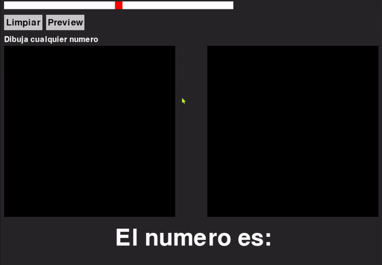

# Deep-Learning Digit Classifier
This is a project that aims to create a model for the classification of numerical digits using Convolutional Neural Network (CNN).Numbers from 0 to 9. We collect the data, built model, train and test the model. We also proposed create an interactive program that would allow the user to draw the digits and see the model clasiffication results.

# Data Collection
While there is MNIST, which is a consolidated database for the classification of numbers. In this project an interface was developed to allow volunteers from the “Deep Learning (2023-2) UIS” course to create their own digits. The interface called MNIXEL is available [here](https://github.com/Konat23/MNIXEL) for anyone to create their own digiT database.

The collected data is available in the data folder. A total of 386 digits were collected from the 29 volunteers, divided as follows:
- Train: 270

- Test: 116

Each digit is a 28x28 pixel image as shown:

# Build Model
The 01_build_model.ipynb file contains the process of building and training the deep neural network from the collected data. In summary the network has convolutional layers, batch normalization, max pooling, dropouts and dense layers at the end.  

The 270 data were used to train the model. The loss metric used was categorical_crossentropy using the adam optimizer, with a batch size of 64. 10% of the training data was used to validate the model. 
## Results:
A total of 191 epochs out of 200 were trained since the cost function decayed very slowly, For the 116 test data resulted in: 

Accuracy: 97%

Confusion Matriz:

# Deployment of the model
Finally we created “02_UI_User_test.py” an interface so that any user can test the model, the program allows to draw the digit and let the model say which digit has been drawn.

# Acknowledgements
- Ph.D. Carlos Fajardo, Deep Learning Teacher for providing the space to develop this project.

- Ing Jennifer Bayona, for her collaboration and support. 

- Ing Angelica Bravo, for her suggestions. 